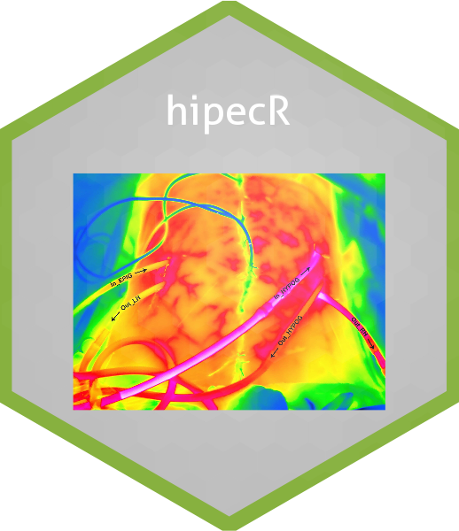

# hipecR

<!-- badges: start -->
[](https://lifecycle.r-lib.org/articles/stages.html#experimental)
[](https://CRAN.R-project.org/package=hipecR)
<!-- badges: end -->

The goal of hipecR is to provide a bunch of helpful function for patient data analysis and some essential functions to calculate the peritoneal surface area (PSA) individually for each patient. After calculating the global PSA, we are able to assess the quantitative PSA before and after cytoredution (surgery).The underlying idea is to provide a reproducible and comparable definition of the resected PSA across different instituions. The next step is to calculate the dosage of the chemotherapy during hyperthermic intraperitoneal chemotherapy (HIPEC) adapted to the remaining PSA.

## Installation

You can install the development version of hipecR like so:

``` r
library(devtools) # Make sure that the devtools library is loaded
install_github("tarjae/hipecR")
```

## Example

This is a basic example which shows you how to solve a common problem:

``` r
library(hipecR)
## basic example code
```

